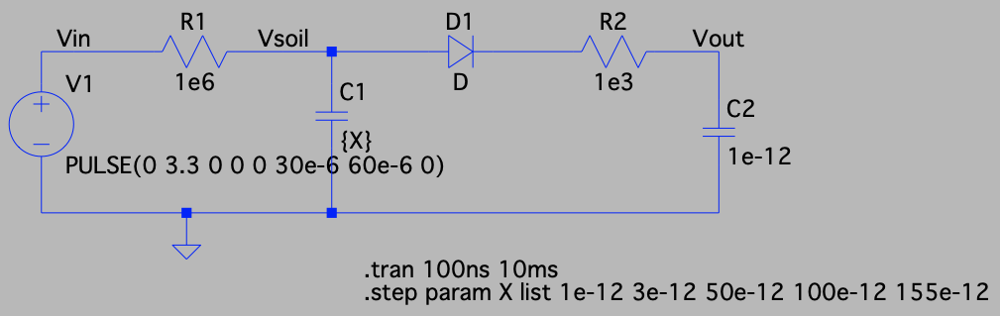
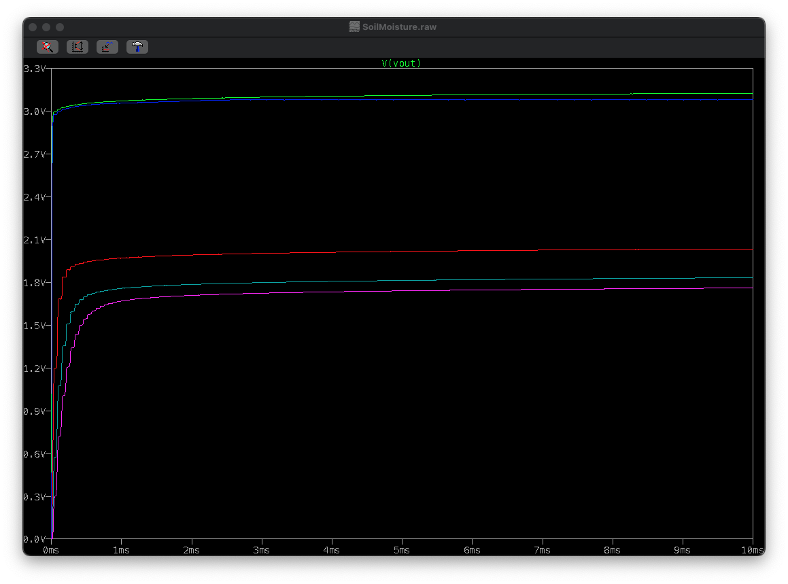

# Lithobot

Named after the Northern Leopard frog, [lithobates pipiens](https://www.ab-conservation.com/avamp/identification-keys/juvenile-and-adult-amphibians-of-alberta/northern-leopard-frog/); a frog that can help keep gardens healthy by eating pests and is currently [threatened in Alberta](https://naturealberta.ca/what-happened-to-the-northern-leopard-frog/).

Implemented using a dAuratus board with the following functionality:
- Soil moisture sensor(s).
- Photocell sunlight sensor.
- Temperature sensor.
- eRibbit wireless link.

**Outdoor Lithobots:**
- Used for yard climate monitoring.
- Sensing: temperature probe(s), sunlight meter, soil moisture probe
- Records sensor data into onboard FLASH with timestamps.
- Serial terminal:
  + Debugging.
  + Sensor data collection adjustments.
- Communicates with main using eRibbit and either a wireless or direct UART link.

**Outdoor Boss Lithobot:**
- Hand held bot for interfacing with secondary outdoor lithobots.
- Direct UART plug into secondary lithobots.
- Serial terminal:
  + Debugging.
  + Downloading data gathered from secondary bots.
- Character display and 3 button interface.
  + Resets time reference for secondary bot.
  + Downloads sensor data.
  + Basic command menu.
  + Presents summary of downloaded data.
  
**Indoor Lithobot:**
- Used for indoor grow table monitoring and climate control.
- Sensing: temperature probe(s), sunlight meter, soil moisture probe
- Fan control.
- Serial terminal:
  + Debugging.
  + Sensor data collection adjustments.
  + Fan control preset creation.
- Character display and 3 button interface.
  + Cycle through fan presets.
  + Present temperature summary.

### Sunlight Sensor

- Start with cheap photo-cells and use the cap charging time constant trick in the AdaFruit document.
- Will require an AVR timer resource.
- These seem to have pretty huge dynamic range (~50kOhm in the dark to a few 100 ohms in full light) so the RC time constant should vary quite a bit even for a slow clock.  Will need to make sure the C is large enough to capture variation at the low (bright light) end.
- Pins: Two digital I/O pins.

### Temperature Sensor

- Option 1: A resistive temperature device (RTD).
  + Resistance must be measured and translated back to temperature.
  + The iST RTD device resistance is $R=R_0(1+AT+BT^2)$ where A=3.91e-3 and B=-5.58e-7.
  + A max expected range of -40C to +50C corresponds to 84 Ohms and 119.4 Ohms, respectively.
  + The easiest circuit is to make a voltage divider that is turned on/off with an open collector I/O pin.  The middle of the divider is connected to the AVR ADC input.  Several RTDs could be collected to this same point and only one of them switched on at a time.  That means $N$ sensors would require only $N$ I/O pins in addition to the ADC input.
  + The measurement current should be around 1mA to avoid self heating effects which would mean a resistor of approximately 3k in series with the RTD.  This means a sensing voltage range of approximately 90mV to 127mV.
  + The on-board non-inverting programmable gain amplifier (PGA) has a gain of $1+R_2/R_1$ and the maximum gain for this configuration would be 16.
  + With an internal op-amplifier with a gain of 16, this range would be 1.44V to 2.03V (approximately a 0.6V difference).
  + This large series resistor makes our sensing voltage pretty small.  The temperature error for the device is $\Delta T = RI^2/E$, where $E$ = 1.8 mW/K and R = 0.1kOhm.  For a balanced 200 Ohm voltage divider and a 3.3V VDD, the error would be around 15 degrees!
  + The 12 bit AVR ADC has $2^12$ = 4096 levels.  For an internal VRef of 3.3V, the 0.6V measurement range would be divided into 745 levels or steps of approximately 0.12 degrees.  That should be fine.
  + The RC time constant method won't work here since the RTD would need to be in series with a 3kOhm resistor.  The change in resistance won't affect the RC time constant enough to be picked up with any resolution using a 32.768kHz clock.
  + Pins: The op-amp input (PD1 or PD4) and any general I/O pins.

- Option 2: The DS18B20 temperature sensor.
  + Single wire serial bus interface to a metal enclosed temperature sensor IC.
  + Park this for now since this is yet another serial protocol to figure out.  Try the RTD instead.
  + Pins: An I/O line.

### Moisture Sensor

Similar to many moisture sensor designs, this design measures moisture levels using the change in capacitance between two plates on a PCB.  This is a coplanar capacitor.  The exact capacitance for a coplanar capacitor [can be derived](https://doi-org.ezproxy.lib.ucalgary.ca/10.1016/j.elstat.2019.103371) for two rectangular strips of width $d$ and center point separation $w$.  My actual plate layout is based on existing moisture sensors with a double wide center plate surrounded by a "U" shaped outer plate.  I assume (with no strong theoretical basis) that this is equivalent to two rectangular plates of identical width and twice the length.  The relative dielectric constant, $\epsilon_r$, of water is approximately 80 and air is approximately 1 so we can expect soil to fall between these two extremes.  Dry earth is between 3 and 5.

The sensor is based on putting the moisture sensitive capacitor into a simple RC circuit and driving it with a square wave.  The period should be such that the positive pulse equals the length of time required for the RC circuit to easily reach its maximum for its smallest possible time constant (air).  As moisture is added to the soil, capacitance increases, rise time increases and the waveform maximum amplitude will reduce.  This RC waveform is passed through a diode and lowpass filter to convert to a constant analog voltage.  This voltage will drop as soil moisture level increases.

The following spice simulation demonstrates (as is typical with these kinds of things) that the analog voltage isn't linear with the differences in relative permittivity.  The relative permittivity corresponds to a moisture capacitor equivalent to two plates 4mm wide and 120mm long separated by 2.3mm.  The pulse width corresponds to what's easy to generate with a low clock rate MCU.  Open the voltage window in a new tab if you can't see the font.

